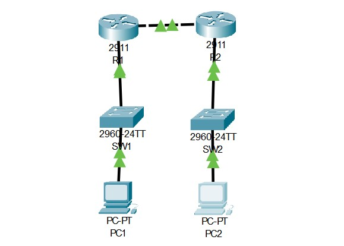
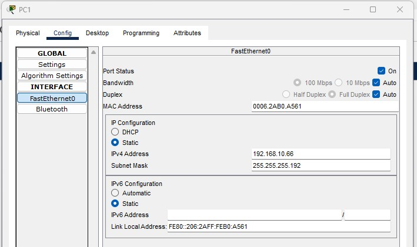
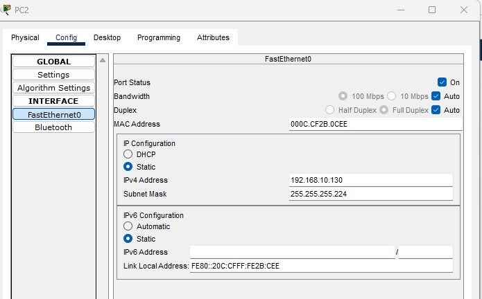
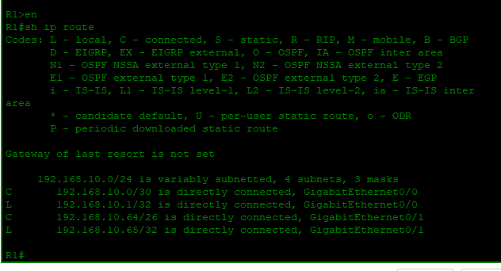

# Lab 01: Subnetting Practice

## Objective
Design and implement a VLSM subnet scheme from a single /24 network. Configure routers, switches, and PCs with calculated IPs. Verify end-to-end connectivity.

---

## What I Did

| Step | Action |
|------|--------|
| 1 | Calculated subnets: /30 for router link, /26 for PC1 LAN, /27 for PC2 LAN |
| 2 | Assigned IPs to R1 and R2 interfaces |
| 3 | Configured switches with trunk and access ports |
| 4 | Set static IPs on PCs with correct gateways |
| 5 | Verified with `show ip route`, `show interfaces trunk`, and `ping` |

---

## Network Design

Given: **192.168.10.0/24**

| Network | Subnet | Network Address | Mask | Gateway |
|---------|--------|-----------------|------|---------|
| R1-R2 Link | /30 | 192.168.10.0 | 255.255.255.252 | — |
| LAN 1 | /26 | 192.168.10.64 | 255.255.255.192 | 192.168.10.65 |
| LAN 2 | /27 | 192.168.10.128 | 255.255.255.224 | 192.168.10.129 |

---

## Topology

---

## Configurations

### Router R1
int g0/0: 192.168.10.1/30
int g0/1: 192.168.10.65/26

text

### Router R2
int g0/0: 192.168.10.2/30
int g0/1: 192.168.10.129/27

text

### Switch SW1
g0/1: trunk
f0/1: access vlan 1

text

### Switch SW2
g0/1: trunk
f0/1: access vlan 1

text

### PC1
IP: 192.168.10.66/26
Gateway: 192.168.10.65

text

### PC2
IP: 192.168.10.130/27
Gateway: 192.168.10.129

text
---

## Verification

| Test | Result |
|------|--------|
| R1 `show ip route` | Connected routes to 192.168.10.0/30 and 192.168.10.64/26 ✅ |
| R2 `show ip route` | Connected routes to 192.168.10.0/30 and 192.168.10.128/27 ✅ |
| `show interfaces trunk` | G0/1 trunk active ✅ |
| PC1 ping PC2 | Successful ✅ |
| PC2 ping PC1 | Successful ✅ |

---

## Skills Demonstrated
 VLSM subnetting
 Router IP assignment
 Switch trunk and access ports
 PC static IP with gateway
 Verification with show commands and ping
---

*Configured by Salim Aden — March 2026*
