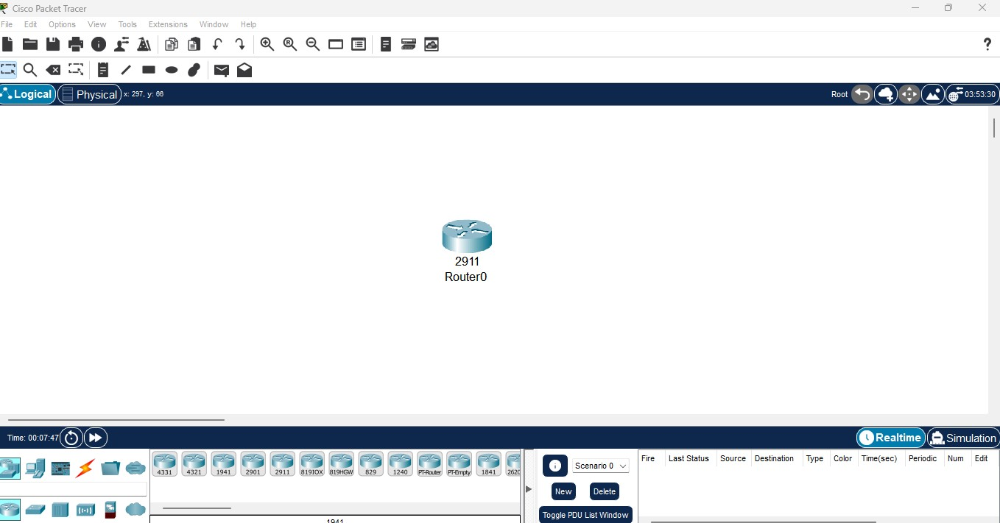
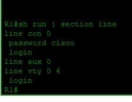

# Lab 02: Basic Device Configuration

## Objective
Configure initial router settings: hostname, MOTD banner, console password, and enable secret.
---

## What I Did

| Step | Action |
|------|--------|
| 1 | Entered privileged mode with `enable` |
| 2 | Set hostname to R1 |
| 3 | Added MOTD banner: "UNAUTHORIZED ACCESS PROHIBITED" |
| 4 | Configured console line with password `cisco` and required login |
| 5 | Set enable secret `salim` for privileged access |
| 6 | Saved configuration with `copy running-config startup-config` |
---

## Topology

---

## Configuration
enable
configure terminal
hostname R1
banner motd #UNAUTHORIZED ACCESS PROHIBITED#
line console 0
password cisco
login
exit
enable secret salim
exit
copy running-config startup-config
---

## Verification

| Test | Result |
|------|--------|
| `show running-config \| section line con` | Shows `password cisco` and `login` ✅ |
| Exit console, press Enter | Password prompt appears ✅ |
| Enter `cisco` | Access granted ✅ |
| Type `enable` | Password prompt appears ✅ |
| Enter `salim` | Privileged mode granted ✅ |

---

## Skills Demonstrated
- Hostname configuration
- MOTD banner
- Console password security
- Enable secret (encrypted)
- Saving configuration

---

*Configured by Salim Aden — March 2026*
