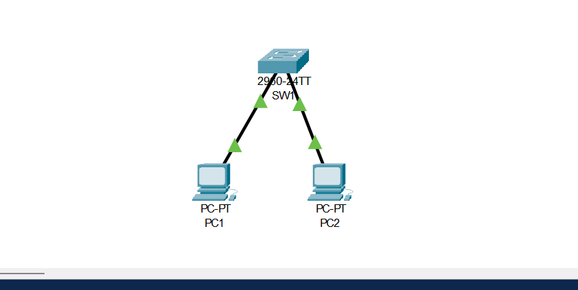
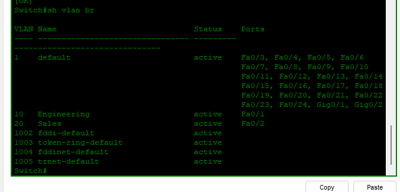

# Lab 01: VLANs and Trunking

## Objective
Create VLAN 10 (Engineering) and VLAN 20 (Sales) on a Cisco switch, assign access ports, and verify segmentation.

---

## What I Did

| Step | Action |
|------|--------|
| 1 | Created VLAN 10 and VLAN 20 |
| 2 | Named VLANs Engineering and Sales |
| 3 | Configured F0/1 as access port in VLAN 10 |
| 4 | Configured F0/2 as access port in VLAN 20 |
| 5 | Verified with `show vlan brief` |

---

## Topology

---

## Configuration
vlan 10
name Engineering
vlan 20
name Sales
interface fastEthernet 0/1
switchport mode access
switchport access vlan 10
interface fastEthernet 0/2
switchport mode access
switchport access vlan 20

---

## Verification
SW1# show vlan brief

VLAN Name Status Ports

1 default active F0/3, F0/4, F0/5...
10 Engineering active F0/1
20 Sales active F0/2

---

## Skills Demonstrated
- VLAN creation and naming
- Access port assignment
- VLAN verification

---

*Configured by Salim Aden — March 2026*
