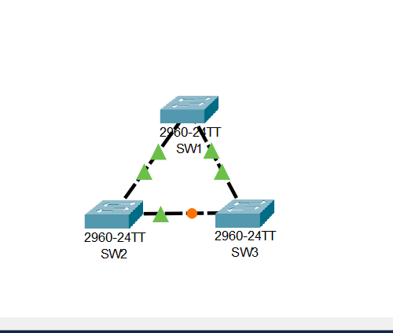
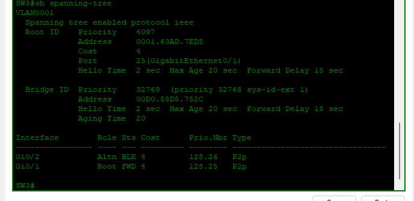

# Lab 02: STP Configuration

## Objective
Configure Spanning Tree Protocol to control root bridge election and prevent network loops in a three-switch topology.

---

## What I Did

| Step | Action | Purpose |
|------|--------|---------|
| 1 | Set SW1 priority to 4096 (`spanning-tree vlan 1 priority 4096`) | Designated SW1 as root bridge |
| 2 | Set SW2 priority to 8192 (`spanning-tree vlan 1 priority 8192`) | Designated SW2 as secondary root |
| 3 | Connected SW1, SW2, SW3 in triangle topology | Created redundant paths requiring STP |
| 4 | Verified STP operation on SW3 | Confirmed one port blocked to prevent loop |

---

## Why This Matters
STP is essential for redundant networks. Without it, broadcast storms would crash the network. This lab demonstrates my ability to:
- Control root bridge election
- Understand priority values (lower = higher priority)
- Verify STP port states (Root, Designated, Alternate)

---

## Topology

*Triangle topology: SW1 (root), SW2 (secondary), SW3 (default)*

---

## Configuration

### SW1 (Root Bridge)
spanning-tree vlan 1 priority 4096

### SW2 (Secondary Root)
spanning-tree vlan 1 priority 8192

### SW3 (Default)
Default STP priority 32768 (no configuration needed)

---

## Verification

### On SW3 – `show spanning-tree`
VLAN0001
Root ID Priority 4097
Address 0001.63AD.7ED5
Cost 4
Port 25 (GigabitEthernet0/1)

Bridge ID Priority 32769
Address 00D0.58D5.752C

Interface Role State
Gi0/1 Root FWD (Path to root bridge)
Gi0/2 Altn BLK (Blocked to prevent loop)

text

---

## What This Proves

| Observation | What It Means |
|-------------|---------------|
| SW1 priority 4096 | SW1 is root bridge (lowest priority) |
| SW2 priority 8192 | SW2 is backup root |
| SW3 priority 32768 | SW3 is non-root |
| Gi0/1 on SW3 = Root (FWD) | Active path to root |
| Gi0/2 on SW3 = Altn (BLK) | Loop prevented by STP |

---

## Skills Demonstrated
- Root bridge election
- STP priority configuration
- Port role identification (Root, Alternate, Designated)
- Loop prevention verification
- Redundant network design

---

*Configured by Salim Aden — CCNA Certified, March 2026*
