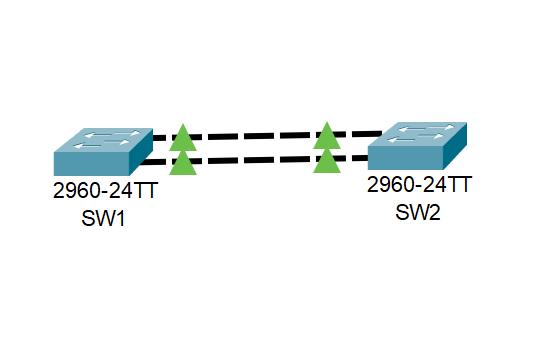
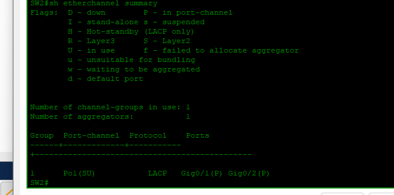

# Lab 03: EtherChannel with LACP

## Objective
Bundle two physical links between switches into a single logical trunk using LACP for increased bandwidth and redundancy.

---

## What I Did

| Step | Action | Purpose |
|------|--------|---------|
| 1 | Configured G0/1 and G0/2 with `channel-group 1 mode active` | Enabled LACP active mode on both interfaces |
| 2 | Created Port-channel 1 interface | Logical bundle interface |
| 3 | Configured Port-channel 1 as trunk with allowed VLAN 1 | Carries VLAN traffic across bundle |
| 4 | Verified with `show etherchannel summary` | Confirmed both ports bundled |

---

## Why This Matters
EtherChannel increases bandwidth (2 Gbps in this lab) and provides redundancy. If one link fails, traffic continues through the remaining link without interruption.

---

## Topology

*SW1 and SW2 connected with two physical links bundled into Port-channel 1*

---

## Configuration

### SW1 and SW2 (Identical)
interface range gigabitEthernet 0/1-2
channel-group 1 mode active
interface port-channel 1
switchport mode trunk
switchport trunk allowed vlan 1

---

## Verification
SW2# show etherchannel summary

Group Port-channel Protocol Ports

1 Po1(SU) LACP Gi0/1(P) Gi0/2(P)

- **Po1(SU)** = Port-channel 1, Layer2 (S), in use (U)
- **Gi0/1(P)** = GigabitEthernet 0/1 bundled
- **Gi0/2(P)** = GigabitEthernet 0/2 bundled

---

## What This Proves

| Observation | What It Means |
|-------------|---------------|
| Both ports in port-channel | Links are successfully bundled |
| Protocol LACP | Using industry-standard link aggregation |
| Trunk configured | Carries VLAN traffic across bundle |

---

## Skills Demonstrated
- LACP configuration (active mode)
- Port-channel interface creation
- Trunk configuration over EtherChannel
- Verification with `show etherchannel summary`

---

*Configured by Salim Aden — CCNA Certified, March 2026*
