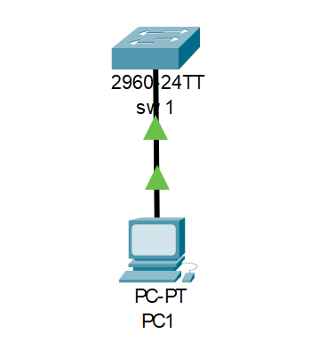
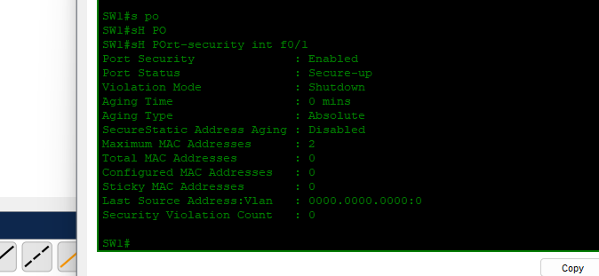

# Lab 04: Port Security

## Objective
Implement port security to control device access, limit MAC addresses, and enforce security policies at the access layer.

---

## Implementation Summary

| Parameter | Configuration |
|-----------|---------------|
| **Interface** | FastEthernet 0/1 |
| **Port Mode** | Access |
| **Port Security** | Enabled |
| **Maximum MAC Addresses** | 2 |
| **Violation Action** | Shutdown |
| **Sticky MAC** | Enabled |

---

## Topology

---

## Configuration

  cisco
interface fastEthernet 0/1
 switchport mode access
 switchport port-security
 switchport port-security maximum 2
 switchport port-security violation shutdown
 switchport port-security mac-address sticky

---

### Verification

SW1# show port-security interface f0/1

Port Security              : Enabled
Port Status                : Secure-up
Violation Mode             : Shutdown
Maximum MAC Addresses      : 2
Total MAC Addresses        : 1
Sticky MAC Addresses       : 1
Security Violation Count   : 0

## What This Proves

Output	Meaning
Port Security: Enabled	Feature is active
Port Status: Secure-up	Port operational and secured
Maximum MAC: 2	Up to 2 devices allowed
Violation Mode: Shutdown	Port disables on violation
Sticky MAC: 1	Learned MAC saved to config
Troubleshooting
Issue	Fix
Port in err-disable	shutdown / no shutdown
Sticky MAC not learning	Verify config, copy run start
Violation occurs	Identify rogue device, recover port
Skills Demonstrated
Port security enable

Maximum MAC address limit

Violation shutdown mode

Sticky MAC learning

err-disable recovery

----

 **Configured by Salim Aden — CCNA Certified, March 2026**
