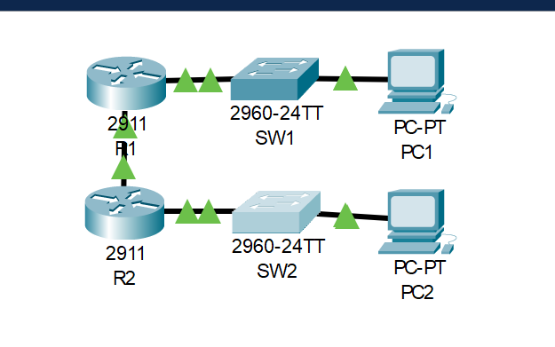
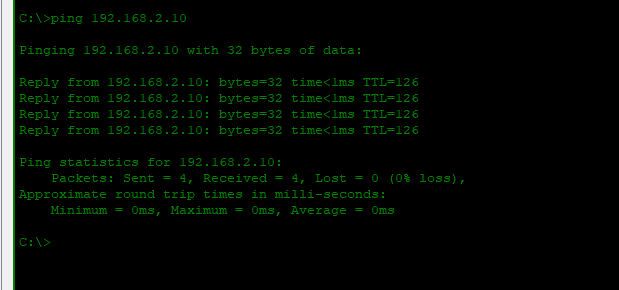

# Lab 01: Static Routing

---

## Objective

In this lab, two Cisco 2911 routers are connected via a `/30` point-to-point link and configured with static routes to enable full end-to-end connectivity between two PCs on separate networks.

R1 is connected to PC1's network (`192.168.1.0/24`) on its `G0/1` interface and links to R2 via `G0/0` using the `10.0.0.0/30` subnet. R2 mirrors this on the opposite side, connecting to PC2's network (`192.168.2.0/24`). Since neither router runs a dynamic routing protocol, a static route is manually added on each — R1 is told to reach `192.168.2.0/24` via R2's IP (`10.0.0.2`), and R2 is told to reach `192.168.1.0/24` via R1's IP (`10.0.0.1`). Both routes must exist for bidirectional communication to work.

Verification confirms the static routes appear in the routing table with an `S` flag and that PC1 can successfully ping PC2 with 0% packet loss.

---

## Network Topology



```
PC1 ─── SW1 ─── R1 ───────── R2 ─── SW2 ─── PC2
              10.0.0.1     10.0.0.2
```

---

## IP Addressing Table

| Device | Interface | IP Address | Subnet Mask | Default Gateway |
|--------|-----------|------------|-------------|-----------------|
| R1 | G0/0 | 10.0.0.1 | 255.255.255.252 | — |
| R1 | G0/1 | 192.168.1.1 | 255.255.255.0 | — |
| R2 | G0/0 | 10.0.0.2 | 255.255.255.252 | — |
| R2 | G0/1 | 192.168.2.1 | 255.255.255.0 | — |
| PC1 | NIC | 192.168.1.10 | 255.255.255.0 | 192.168.1.1 |
| PC2 | NIC | 192.168.2.10 | 255.255.255.0 | 192.168.2.1 |

---

## Configuration

### Router R1

```cisco
hostname R1

interface GigabitEthernet0/0
 ip address 10.0.0.1 255.255.255.252
 no shutdown

interface GigabitEthernet0/1
 ip address 192.168.1.1 255.255.255.0
 no shutdown

ip route 192.168.2.0 255.255.255.0 10.0.0.2
```

### Router R2

```cisco
hostname R2

interface GigabitEthernet0/0
 ip address 10.0.0.2 255.255.255.252
 no shutdown

interface GigabitEthernet0/1
 ip address 192.168.2.1 255.255.255.0
 no shutdown

ip route 192.168.1.0 255.255.255.0 10.0.0.1
```

---

## Verification

### Routing Table — R1


```
R1# show ip route

C    10.0.0.0/30 is directly connected, GigabitEthernet0/0
C    192.168.1.0/24 is directly connected, GigabitEthernet0/1
S    192.168.2.0/24 [1/0] via 10.0.0.2
```

The `S` entry confirms the static route to PC2's network is installed and forwarding via R2.

---

### End-to-End Connectivity — PC1 → PC2



```
C:\> ping 192.168.2.10

Reply from 192.168.2.10: bytes=32 time<1ms TTL=126
Reply from 192.168.2.10: bytes=32 time<1ms TTL=126
Reply from 192.168.2.10: bytes=32 time<1ms TTL=126
Reply from 192.168.2.10: bytes=32 time<1ms TTL=126

Packets: Sent = 4, Received = 4, Lost = 0 (0% loss)
```

---

## Skills Demonstrated

- Static route configuration and next-hop addressing
- Point-to-point link subnetting using `/30`
- Router interface configuration and verification
- Bidirectional routing between two separate networks
- Routing table verification and end-to-end connectivity testing

---

*Documented by Salim Aden*
