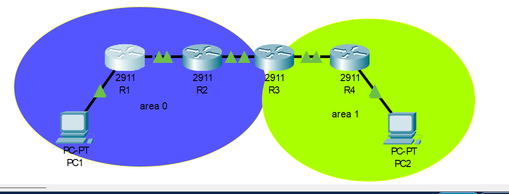
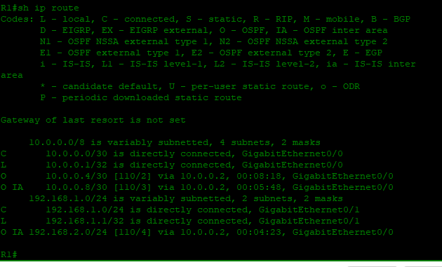
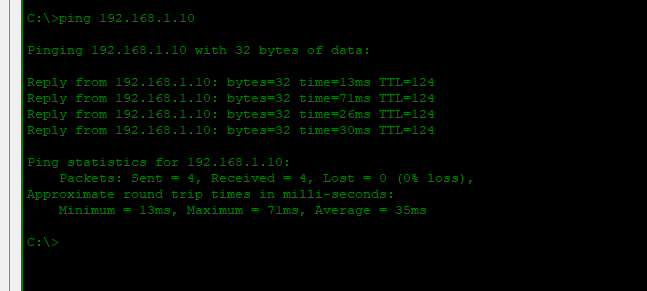

# Lab 02: OSPF — Single & Multi-Area

---

## Objective

- Configure OSPFv2 across four routers spanning Area 0 and Area 1
- Establish R3 as the Area Border Router (ABR) connecting both areas
- Advertise each router's interfaces into the correct OSPF area using network statements and wildcard masks
- Allow OSPF to automatically discover neighbors and calculate best paths without manual route configuration
- Verify inter-area routes appear in the routing table with `O` and `O IA` flags
- Confirm end-to-end connectivity between PC1 and PC2 across both areas

---

## Network Topology



```
        Area 0                          Area 1
PC1 ── R1 ──── R2 ──── R3 (ABR) ──── R4 ── PC2
```

---

## IP Addressing Table

| Device | Interface | IP Address | Subnet Mask | Area |
|--------|-----------|------------|-------------|------|
| R1 | G0/0 | 10.0.0.1 | 255.255.255.252 | 0 |
| R1 | G0/1 | 192.168.1.1 | 255.255.255.0 | 0 |
| R2 | G0/0 | 10.0.0.2 | 255.255.255.252 | 0 |
| R2 | G0/1 | 10.0.0.5 | 255.255.255.252 | 0 |
| R3 | G0/0 | 10.0.0.6 | 255.255.255.252 | 0 |
| R3 | G0/1 | 10.0.0.9 | 255.255.255.252 | 1 |
| R4 | G0/0 | 10.0.0.10 | 255.255.255.252 | 1 |
| R4 | G0/1 | 192.168.2.1 | 255.255.255.0 | 1 |
| PC1 | NIC | 192.168.1.10 | 255.255.255.0 | — |
| PC2 | NIC | 192.168.2.10 | 255.255.255.0 | — |

---

## Configuration

### Router R1 — Area 0

```cisco
hostname R1

interface GigabitEthernet0/0
 ip address 10.0.0.1 255.255.255.252
 no shutdown

interface GigabitEthernet0/1
 ip address 192.168.1.1 255.255.255.0
 no shutdown

router ospf 1
 network 10.0.0.0 0.0.0.3 area 0
 network 192.168.1.0 0.0.0.255 area 0
```

### Router R2 — Area 0

```cisco
hostname R2

interface GigabitEthernet0/0
 ip address 10.0.0.2 255.255.255.252
 no shutdown

interface GigabitEthernet0/1
 ip address 10.0.0.5 255.255.255.252
 no shutdown

router ospf 1
 network 10.0.0.0 0.0.0.3 area 0
 network 10.0.0.4 0.0.0.3 area 0
```

### Router R3 — ABR (Area 0 + Area 1)

```cisco
hostname R3

interface GigabitEthernet0/0
 ip address 10.0.0.6 255.255.255.252
 no shutdown

interface GigabitEthernet0/1
 ip address 10.0.0.9 255.255.255.252
 no shutdown

router ospf 1
 network 10.0.0.4 0.0.0.3 area 0
 network 10.0.0.8 0.0.0.3 area 1
```

### Router R4 — Area 1

```cisco
hostname R4

interface GigabitEthernet0/0
 ip address 10.0.0.10 255.255.255.252
 no shutdown

interface GigabitEthernet0/1
 ip address 192.168.2.1 255.255.255.0
 no shutdown

router ospf 1
 network 10.0.0.8 0.0.0.3 area 1
 network 192.168.2.0 0.0.0.255 area 1
```

---

## Verification

### Routing Table — R1



```
R1# show ip route

O     10.0.0.4/30 [110/2] via 10.0.0.2, GigabitEthernet0/0
O IA  10.0.0.8/30 [110/3] via 10.0.0.2, GigabitEthernet0/0
O IA  192.168.2.0/24 [110/4] via 10.0.0.2, GigabitEthernet0/0
```

`O` entries are intra-area routes learned within Area 0. `O IA` entries are inter-area routes learned from Area 1 via R3 (ABR).

---

### End-to-End Connectivity — PC2 → PC1



```
C:\> ping 192.168.1.10

Reply from 192.168.1.10: bytes=32 time=13ms TTL=124
Reply from 192.168.1.10: bytes=32 time=71ms TTL=124
Reply from 192.168.1.10: bytes=32 time=26ms TTL=124
Reply from 192.168.1.10: bytes=32 time=30ms TTL=124

Packets: Sent = 4, Received = 4, Lost = 0 (0% loss)
```

---

## Skills Demonstrated

- OSPFv2 configuration across a multi-area topology
- Area Border Router (ABR) design connecting Area 0 and Area 1
- OSPF network statements using wildcard masks
- Inter-area route propagation and routing table interpretation
- End-to-end connectivity verification across multiple OSPF areas

---

*Documented by **Salim Aden** — [CCNA Networking Labs Portfolio](../../README.md)*
