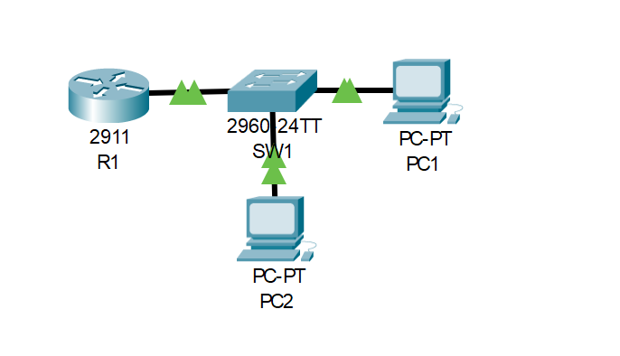

# Lab 03: Router on a Stick

---

## Objective

- Configure inter-VLAN routing using a single router interface with 802.1Q subinterfaces
- Create VLAN 10 and VLAN 20 on SW1 and assign PC1 and PC2 to their respective VLANs
- Configure the switch uplink to R1 as a trunk port to carry both VLANs
- Assign subinterfaces `G0/0.10` and `G0/0.20` on R1 as the default gateways for each VLAN
- Verify VLAN assignment with `show vlan brief` and interface status with `show ip interface brief`
- Confirm inter-VLAN connectivity with a successful ping from PC1 to PC2

---

## Network Topology



```
PC1 (VLAN 10) ──┐
                 SW1 ──[Trunk]── R1
PC2 (VLAN 20) ──┘
```

---

## IP Addressing Table

| Device | Interface | IP Address | Subnet Mask | Default Gateway |
|--------|-----------|------------|-------------|-----------------|
| R1 | G0/0.10 | 192.168.10.1 | 255.255.255.0 | — |
| R1 | G0/0.20 | 192.168.20.1 | 255.255.255.0 | — |
| PC1 | NIC | 192.168.10.10 | 255.255.255.0 | 192.168.10.1 |
| PC2 | NIC | 192.168.20.10 | 255.255.255.0 | 192.168.20.1 |

---

## VLAN Table

| VLAN | Name | Port | Network |
|------|------|------|---------|
| 10 | Vlan10 | Fa0/1 | 192.168.10.0/24 |
| 20 | Vlan20 | Fa0/2 | 192.168.20.0/24 |

---

## Configuration

### Router R1

```cisco
hostname R1

interface GigabitEthernet0/0
 no ip address
 no shutdown

interface GigabitEthernet0/0.10
 encapsulation dot1Q 10
 ip address 192.168.10.1 255.255.255.0

interface GigabitEthernet0/0.20
 encapsulation dot1Q 20
 ip address 192.168.20.1 255.255.255.0
```

### Switch SW1

```cisco
hostname SW1

interface FastEthernet0/1
 switchport mode access
 switchport access vlan 10

interface FastEthernet0/2
 switchport mode access
 switchport access vlan 20

interface GigabitEthernet0/1
 switchport mode trunk
```

---

## Verification

### VLAN Assignment — SW1


```
SW1# show vlan brief

VLAN  Name    Status    Ports
10    Vlan10  active    Fa0/1
20    Vlan20  active    Fa0/2
```

---

### Interface Status — R1


```
R1# show ip interface brief

Interface              IP-Address      Status    Protocol
GigabitEthernet0/0     unassigned      up        up
GigabitEthernet0/0.10  192.168.10.1   up        up
GigabitEthernet0/0.20  192.168.20.1   up        up
```

---

### End-to-End Connectivity — PC1 → PC2


```
C:\> ping 192.168.20.10

Reply from 192.168.20.10: bytes=32 time<1ms TTL=127
Reply from 192.168.20.10: bytes=32 time<1ms TTL=127
Reply from 192.168.20.10: bytes=32 time<1ms TTL=127
Reply from 192.168.20.10: bytes=32 time<1ms TTL=127

Packets: Sent = 4, Received = 4, Lost = 0 (0% loss)
```

---

## Skills Demonstrated

- Inter-VLAN routing using the Router-on-a-Stick method
- 802.1Q subinterface configuration with `encapsulation dot1Q`
- VLAN creation and access port assignment on a Cisco switch
- Trunk port configuration between switch and router
- VLAN and interface verification using `show vlan brief` and `show ip interface brief`

---

*Documented by Salim Aden*
