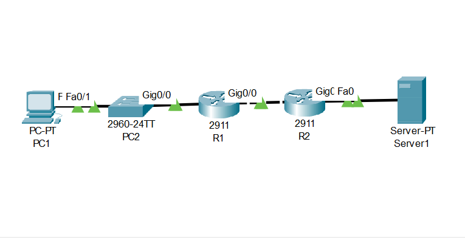
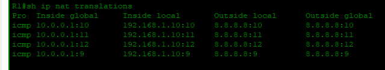
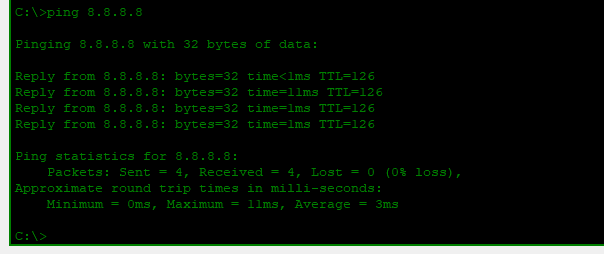

# Lab 01: NAT — PAT Overload

---

## Objective

- Configure PAT (NAT Overload) on R1 to allow PC1 on the inside network to reach a public server at `8.8.8.8`
- Define inside and outside NAT interfaces on R1 using `ip nat inside` and `ip nat outside`
- Create an access list to identify the inside network (`192.168.1.0/24`) eligible for translation
- Apply NAT overload so multiple inside hosts share a single public IP on R1's outside interface
- Configure a default route on R1 pointing to R2 for internet-bound traffic
- Verify active NAT translations with `show ip nat translations` and confirm connectivity with a ping from PC1 to `8.8.8.8`

---

## Network Topology



```
PC1 ─── SW1 ─── R1 ─── R2 ─── Server1
   192.168.1.0/24    10.0.0.0/30    8.8.8.0/24
```

---

## IP Addressing Table

| Device | Interface | IP Address | Subnet Mask | Default Gateway |
|--------|-----------|------------|-------------|-----------------|
| R1 | G0/0 | 192.168.1.1 | 255.255.255.0 | — |
| R1 | G0/1 | 10.0.0.1 | 255.255.255.252 | — |
| R2 | G0/0 | 10.0.0.2 | 255.255.255.252 | — |
| R2 | G0/1 | 8.8.8.1 | 255.255.255.0 | — |
| PC1 | NIC | 192.168.1.10 | 255.255.255.0 | 192.168.1.1 |
| Server1 | NIC | 8.8.8.8 | 255.255.255.0 | 8.8.8.1 |

---

## Configuration

### Router R1 — NAT Router

```cisco
hostname R1

interface GigabitEthernet0/0
 ip address 192.168.1.1 255.255.255.0
 ip nat inside
 no shutdown

interface GigabitEthernet0/1
 ip address 10.0.0.1 255.255.255.252
 ip nat outside
 no shutdown

access-list 1 permit 192.168.1.0 0.0.0.255

ip nat inside source list 1 interface GigabitEthernet0/1 overload

ip route 0.0.0.0 0.0.0.0 10.0.0.2
```

### Router R2 — Internet Router

```cisco
hostname R2

interface GigabitEthernet0/0
 ip address 10.0.0.2 255.255.255.252
 no shutdown

interface GigabitEthernet0/1
 ip address 8.8.8.1 255.255.255.0
 no shutdown

ip route 192.168.1.0 255.255.255.0 10.0.0.1
```

---

## Verification

### NAT Translations — R1



```
R1# show ip nat translations

Pro  Inside global   Inside local    Outside local   Outside global
icmp 10.0.0.1:10     192.168.1.10:10 8.8.8.10        8.8.8.10
icmp 10.0.0.1:11     192.168.1.10:11 8.8.8.11        8.8.8.11
```

The inside local address `192.168.1.10` is being translated to the outside interface IP `10.0.0.1` — confirming PAT overload is active.

---

### End-to-End Connectivity — PC1 → Server1



```
C:\> ping 8.8.8.8

Reply from 8.8.8.8: bytes=32 time<1ms TTL=126
Reply from 8.8.8.8: bytes=32 time=11ms TTL=126
Reply from 8.8.8.8: bytes=32 time=1ms  TTL=126
Reply from 8.8.8.8: bytes=32 time=1ms  TTL=126

Packets: Sent = 4, Received = 4, Lost = 0 (0% loss)
```

---

## Skills Demonstrated

- PAT (NAT Overload) configuration using a standard access list
- Inside and outside NAT interface designation
- Default route configuration for internet-bound traffic
- NAT translation table verification using `show ip nat translations`
- End-to-end connectivity testing from a private host to a public server

---

*Documented by Salim Aden*
