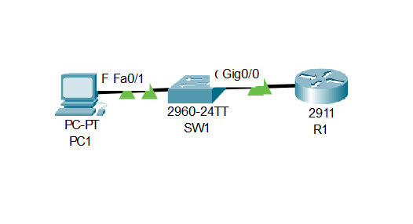
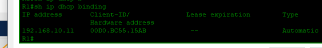
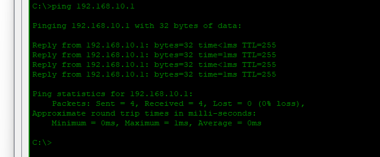

# Lab 02: DHCP

---

## Objective

- Configure R1 as a DHCP server to dynamically assign IP addresses to hosts on the `192.168.10.0/24` network
- Exclude the first 10 addresses from the pool to reserve them for static assignment
- Create a DHCP pool named `Salim` with the correct network, default gateway, and DNS server
- Set PC1 to obtain its IP address automatically via DHCP
- Verify the lease appears in the DHCP binding table using `show ip dhcp binding`
- Confirm connectivity from PC1 to R1's gateway with a successful ping

---

## Network Topology



```
PC1 ─── SW1 ─── R1
            192.168.10.1
```

---

## IP Addressing Table

| Device | Interface | IP Address | Subnet Mask | Assigned By |
|--------|-----------|------------|-------------|-------------|
| R1 | G0/0 | 192.168.10.1 | 255.255.255.0 | Static |
| PC1 | NIC | 192.168.10.11 | 255.255.255.0 | DHCP |

---

## DHCP Pool

| Parameter | Value |
|-----------|-------|
| Pool Name | Salim |
| Network | 192.168.10.0/24 |
| Default Gateway | 192.168.10.1 |
| DNS Server | 8.8.8.8 |
| Excluded Range | 192.168.10.1 – 192.168.10.10 |

---

## Configuration

### Router R1

```cisco
hostname R1

ip dhcp excluded-address 192.168.10.1 192.168.10.10

ip dhcp pool Salim
 network 192.168.10.0 255.255.255.0
 default-router 192.168.10.1
 dns-server 8.8.8.8

interface GigabitEthernet0/0
 ip address 192.168.10.1 255.255.255.0
 no shutdown
```

---

## Verification

### DHCP Binding Table — R1



```
R1# show ip dhcp binding

IP Address      Client-ID / Hardware Address    Lease Expiration    Type
192.168.10.11   00D0.BC55.15AB                  --                  Automatic
```

PC1 received `192.168.10.11` — the first available address after the excluded range.

---

### Connectivity — PC1 → R1



```
C:\> ping 192.168.10.1

Reply from 192.168.10.1: bytes=32 time<1ms TTL=255
Reply from 192.168.10.1: bytes=32 time=1ms  TTL=255
Reply from 192.168.10.1: bytes=32 time<1ms TTL=255
Reply from 192.168.10.1: bytes=32 time<1ms TTL=255

Packets: Sent = 4, Received = 4, Lost = 0 (0% loss)
```

---

## Skills Demonstrated

- DHCP server configuration on a Cisco router
- Address exclusion to reserve IPs for static assignment
- DHCP pool creation with gateway and DNS parameters
- Dynamic IP assignment verification using `show ip dhcp binding`
- End-to-end connectivity testing between a DHCP client and its gateway

---

*Documented by Salim Aden*
