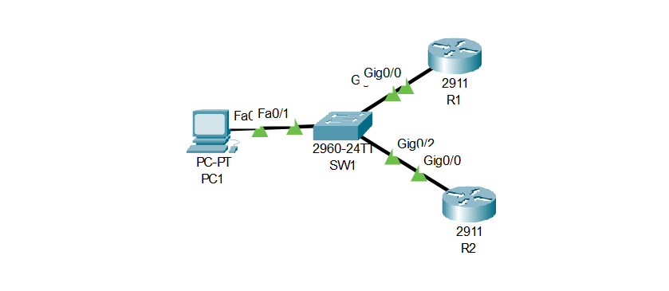
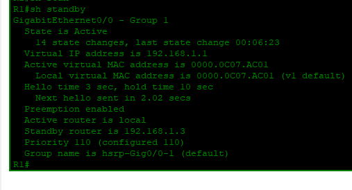
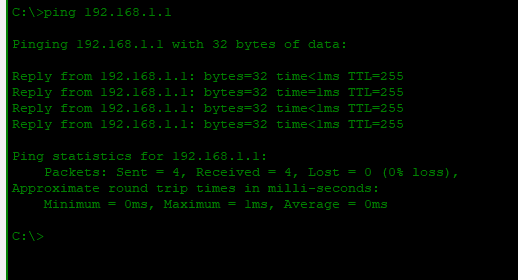

# Lab 03: HSRP — Hot Standby Router Protocol

---

## Objective

- Configure HSRP between R1 and R2 to provide a redundant default gateway for PC1
- Assign R1 as the active router using a higher priority (`110`) with preemption enabled
- Assign R2 as the standby router with the default priority
- Share a virtual IP of `192.168.1.1` across both routers — the address PC1 uses as its gateway
- Verify HSRP state on R1 shows `Active` and R2 shows `Standby`
- Confirm PC1 can reach the virtual gateway with a successful ping

---

## Network Topology



```
        R1 (Active)
       /
PC1 ─ SW1
       \
        R2 (Standby)
```

---

## IP Addressing Table

| Device | Interface | IP Address | Subnet Mask | Default Gateway |
|--------|-----------|------------|-------------|-----------------|
| R1 | G0/0 | 192.168.1.2 | 255.255.255.0 | — |
| R2 | G0/0 | 192.168.1.3 | 255.255.255.0 | — |
| Virtual IP | — | 192.168.1.1 | 255.255.255.0 | — |
| PC1 | NIC | 192.168.1.10 | 255.255.255.0 | 192.168.1.1 |

---

## HSRP Summary

| Parameter | R1 | R2 |
|-----------|----|----|
| Role | Active | Standby |
| Real IP | 192.168.1.2 | 192.168.1.3 |
| Virtual IP | 192.168.1.1 | 192.168.1.1 |
| Priority | 110 | 100 (default) |
| Preempt | Yes | No |

---

## Configuration

### Router R1 — Active

```cisco
hostname R1

interface GigabitEthernet0/0
 ip address 192.168.1.2 255.255.255.0
 standby 1 ip 192.168.1.1
 standby 1 priority 110
 standby 1 preempt
 no shutdown
```

### Router R2 — Standby

```cisco
hostname R2

interface GigabitEthernet0/0
 ip address 192.168.1.3 255.255.255.0
 standby 1 ip 192.168.1.1
 no shutdown
```

---

## Verification

### HSRP State — R1



```
R1# show standby

GigabitEthernet0/0 - Group 1
  State is Active
  Virtual IP address is 192.168.1.1
  Active virtual MAC address is 0000.0C07.AC01
  Preemption enabled
  Standby router is 192.168.1.3
  Priority 110 (configured 110)
```

R1 is confirmed as the **Active** router. The virtual MAC `0000.0C07.AC01` is the HSRP-generated address PC1 uses to reach its gateway.

---

### Connectivity — PC1 → Virtual Gateway



```
C:\> ping 192.168.1.1

Reply from 192.168.1.1: bytes=32 time<1ms TTL=255
Reply from 192.168.1.1: bytes=32 time=1ms  TTL=255
Reply from 192.168.1.1: bytes=32 time<1ms TTL=255
Reply from 192.168.1.1: bytes=32 time<1ms TTL=255

Packets: Sent = 4, Received = 4, Lost = 0 (0% loss)
```

---

## Skills Demonstrated

- HSRP configuration for default gateway redundancy
- Active and standby router role assignment using priority and preempt
- Virtual IP shared between two routers on the same segment
- HSRP state verification using `show standby`
- Connectivity testing to the virtual gateway from an end host

---

*Documented by Salim Aden*
