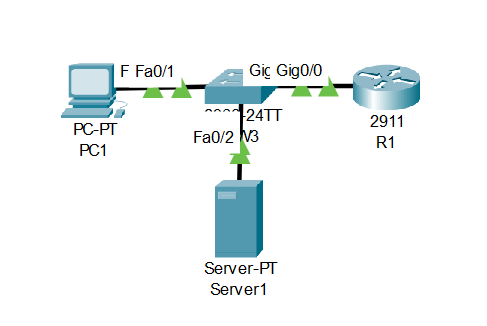
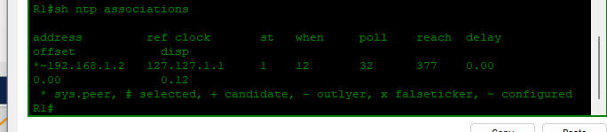
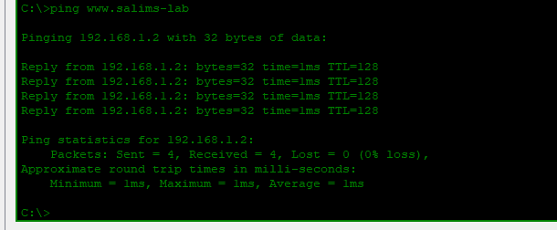

# Lab 04: NTP + DNS

---

## Objective

- Configure Server1 as both an NTP server and DNS server on the `192.168.1.0/24` network
- Add a DNS A record resolving `www.salims-lab` to `192.168.1.2`
- Configure R1 as an NTP client pointing to Server1 at `192.168.1.2`
- Set PC1 to use Server1 as its DNS server for hostname resolution
- Verify NTP synchronization on R1 using `show ntp associations`
- Confirm DNS resolution works by pinging `www.salims-lab` from PC1 and receiving a reply from `192.168.1.2`

---

## Network Topology



```
PC1 ─── SW1 ─── R1
         │
       Server1 (NTP + DNS)
       192.168.1.2
```

---

## IP Addressing Table

| Device | Interface | IP Address | Subnet Mask | Default Gateway | DNS Server |
|--------|-----------|------------|-------------|-----------------|------------|
| R1 | G0/0 | 192.168.1.1 | 255.255.255.0 | — | — |
| Server1 | NIC | 192.168.1.2 | 255.255.255.0 | 192.168.1.1 | 192.168.1.2 |
| PC1 | NIC | 192.168.1.10 | 255.255.255.0 | 192.168.1.1 | 192.168.1.2 |

---

## DNS Record

| Hostname | Record Type | IP Address |
|----------|-------------|------------|
| www.salims-lab | A | 192.168.1.2 |

---

## Configuration

### Router R1 — NTP Client

```cisco
hostname R1

interface GigabitEthernet0/0
 ip address 192.168.1.1 255.255.255.0
 no shutdown

ntp server 192.168.1.2
```

### Server1

Configured via Packet Tracer GUI:

- **DNS:** ON — A record `www.salims-lab → 192.168.1.2`
- **NTP:** ON — Server1 acts as the time source for R1

---

## Verification

### NTP Associations — R1



```
R1# show ntp associations

address        ref clock   st  when  poll  reach  delay  offset
*~192.168.1.2  127.127.1.1  1   12    32    377    0.00   0.00

* sys.peer, # selected, + candidate, - outlyer, x falseticker, ~ configured
```

The `*` confirms R1 has selected `192.168.1.2` as its NTP sync source.

---

### DNS Resolution — PC1 → www.salims-lab



```
C:\> ping www.salims-lab

Pinging 192.168.1.2 with 32 bytes of data:

Reply from 192.168.1.2: bytes=32 time=1ms TTL=128
Reply from 192.168.1.2: bytes=32 time=1ms TTL=128
Reply from 192.168.1.2: bytes=32 time=1ms TTL=128
Reply from 192.168.1.2: bytes=32 time=1ms TTL=128

Packets: Sent = 4, Received = 4, Lost = 0 (0% loss)
```

PC1 resolved `www.salims-lab` to `192.168.1.2` — confirming DNS is working correctly.

---

## Skills Demonstrated

- DNS server configuration and A record creation for hostname resolution
- NTP server and client configuration for clock synchronization
- NTP association verification using `show ntp associations`
- DNS resolution testing by hostname ping from an end host
- Integrated IP services deployment on a single LAN segment

---

*Documented by Salim Aden*
