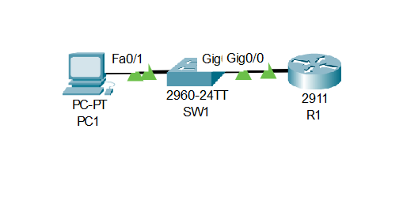
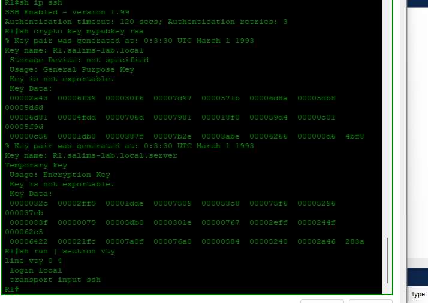

# Lab 02: SSH 

---

## Objective

- Configure a domain name on R1 required for RSA key generation
- Create a local user account (`Admin`) for authenticated SSH access
- Generate RSA encryption keys to enable SSH on the router
- Restrict VTY lines to accept SSH only — blocking Telnet
- Verify SSH is enabled using `show ip ssh` and confirm RSA keys with `show crypto key mypubkey rsa`
- Confirm VTY configuration enforces local authentication and SSH-only transport

---

## Network Topology



```
PC1 ─── SW1 ─── R1
          192.168.1.1
```

---

## IP Addressing Table

| Device | Interface | IP Address | Subnet Mask | Default Gateway |
|--------|-----------|------------|-------------|-----------------|
| R1 | G0/0 | 192.168.1.1 | 255.255.255.0 | — |
| PC1 | NIC | 192.168.1.10 | 255.255.255.0 | 192.168.1.1 |

---

## Configuration

### Router R1

```cisco
hostname R1

ip domain-name salims-lab.local

username Admin secret Cisco123

crypto key generate rsa
! Enter 768 when prompted for key size

interface GigabitEthernet0/0
 ip address 192.168.1.1 255.255.255.0
 no shutdown

line vty 0 4
 login local
 transport input ssh
```

---

## Verification

### SSH Status + RSA Keys + VTY Config — R1



```
R1# show ip ssh

SSH Enabled - version 1.99
Authentication timeout: 120 secs; Authentication retries: 3

R1# show crypto key mypubkey rsa

Key name: R1.salims-lab.local
Usage: General Purpose Key
Key is not exportable.

R1# show run | section vty

line vty 0 4
 login local
 transport input ssh
```

SSH version 1.99 is active, RSA keys are generated under the domain `R1.salims-lab.local`, and VTY lines are locked to SSH with local authentication — Telnet access is blocked.

---

## Skills Demonstrated

- SSH enablement on a Cisco router using RSA key generation
- Domain name configuration as a prerequisite for SSH
- Local user account creation for authenticated access
- VTY line hardening — SSH only, no Telnet
- SSH and RSA key verification using `show ip ssh` and `show crypto key mypubkey rsa`

---

*Documented by Salim Aden*
