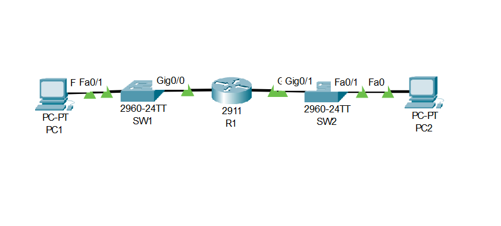
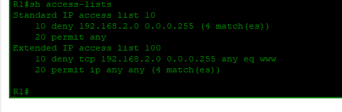
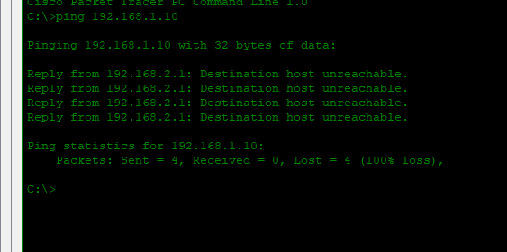

# Lab 01: ACL Security — Standard + Extended

---

## Objective

- Configure a Standard ACL (`access-list 10`) to block all traffic from LAN2 (`192.168.2.0/24`) from reaching LAN1 (`192.168.1.0/24`)
- Configure an Extended ACL (`access-list 100`) to block HTTP traffic (`port 80`) originating from LAN2
- Apply ACL 10 outbound on `G0/0` and ACL 100 inbound on `G0/1`
- Verify both ACLs are active and matching traffic using `show access-lists`
- Confirm PC2 cannot reach PC1 — receiving `Destination host unreachable` — while the ACL hit counters increment

---

## Network Topology



```
PC1 ─── SW1 ─── R1 ─── SW2 ─── PC2
  192.168.1.0/24      192.168.2.0/24
```

---

## IP Addressing Table

| Device | Interface | IP Address | Subnet Mask | Default Gateway |
|--------|-----------|------------|-------------|-----------------|
| R1 | G0/0 | 192.168.1.1 | 255.255.255.0 | — |
| R1 | G0/1 | 192.168.2.1 | 255.255.255.0 | — |
| PC1 | NIC | 192.168.1.10 | 255.255.255.0 | 192.168.1.1 |
| PC2 | NIC | 192.168.2.10 | 255.255.255.0 | 192.168.2.1 |

---

## ACL Summary

| ACL | Type | Rule | Applied | Direction |
|-----|------|------|---------|-----------|
| 10 | Standard | Deny `192.168.2.0/24`, permit any | G0/0 | Outbound |
| 100 | Extended | Deny TCP `192.168.2.0/24` → any port 80, permit ip any any | G0/1 | Inbound |

---

## Configuration

### Router R1

```cisco
hostname R1

interface GigabitEthernet0/0
 ip address 192.168.1.1 255.255.255.0
 ip access-group 10 out
 no shutdown

interface GigabitEthernet0/1
 ip address 192.168.2.1 255.255.255.0
 ip access-group 100 in
 no shutdown

access-list 10 deny 192.168.2.0 0.0.0.255
access-list 10 permit any

access-list 100 deny tcp 192.168.2.0 0.0.0.255 any eq www
access-list 100 permit ip any any
```

---

## Verification

### ACL Hit Counters — R1



```
R1# show access-lists

Standard IP access list 10
    10 deny 192.168.2.0 0.0.0.255 (4 matches)
    20 permit any

Extended IP access list 100
    10 deny tcp 192.168.2.0 0.0.0.255 any eq www (4 matches)
    20 permit ip any any
```

Both ACLs show active match counters — confirming traffic is being evaluated and blocked correctly.

---

### Blocked Traffic — PC2 → PC1



```
C:\> ping 192.168.1.10

Reply from 192.168.2.1: Destination host unreachable.
Reply from 192.168.2.1: Destination host unreachable.
Reply from 192.168.2.1: Destination host unreachable.
Reply from 192.168.2.1: Destination host unreachable.

Packets: Sent = 4, Received = 0, Lost = 4 (100% loss)
```

PC2 is blocked from reaching PC1 — Standard ACL 10 is working as intended.

---

## Skills Demonstrated

- Standard ACL configuration to filter traffic by source network
- Extended ACL configuration to filter traffic by protocol and port
- ACL placement — outbound on the destination interface, inbound on the source interface
- ACL verification using `show access-lists` and hit counter analysis
- Traffic blocking confirmation through end-host ping testing

---

*Documented by Salim Aden*
