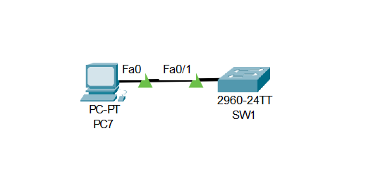
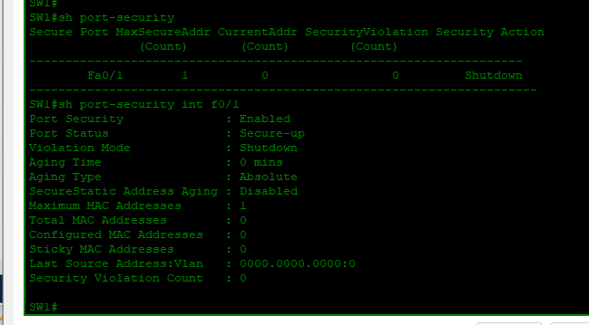

# Lab 03: Port Security

---

## Objective

- Enable port security on SW1's `Fa0/1` interface to restrict access to a single authorized device
- Configure sticky MAC learning so the switch automatically records the connected device's MAC address
- Set the violation mode to `Shutdown` so the port enters err-disabled state if an unauthorized device connects
- Verify port security status using `show port-security` and `show port-security interface f0/1`
- Confirm the port is in `Secure-up` state with the correct security parameters applied

---

## Network Topology



```
PC7 ─── SW1 (Fa0/1)
```

---

## Port Security Configuration Summary

| Parameter | Value |
|-----------|-------|
| Interface | Fa0/1 |
| Maximum MAC Addresses | 1 |
| MAC Learning | Sticky |
| Violation Mode | Shutdown |
| Port Status | Secure-up |

---

## Configuration

### Switch SW1

```cisco
hostname SW1

interface FastEthernet0/1
 switchport mode access
 switchport port-security
 switchport port-security maximum 1
 switchport port-security mac-address sticky
 switchport port-security violation shutdown
```

---

## Verification

### Port Security Status — SW1



```
SW1# show port-security

Secure Port  MaxSecureAddr  CurrentAddr  SecurityViolation  Security Action
               (Count)        (Count)        (Count)
---------------------------------------------------------------------------
      Fa0/1          1            0               0              Shutdown

SW1# show port-security interface f0/1

Port Security              : Enabled
Port Status                : Secure-up
Violation Mode             : Shutdown
Aging Time                 : 0 mins
Maximum MAC Addresses      : 1
Total MAC Addresses        : 0
Configured MAC Addresses   : 0
Sticky MAC Addresses       : 0
Security Violation Count   : 0
```

Port security is enabled on `Fa0/1` with a maximum of 1 MAC address, sticky learning active, and shutdown as the violation response.

---

## Skills Demonstrated

- Port security configuration on a Cisco switch access port
- Sticky MAC address learning for automatic device authorization
- Violation mode configuration to shut down unauthorized access attempts
- Port security verification using `show port-security` and `show port-security interface`
- Switch access port hardening as a Layer 2 security measure

---

*Documented by Salim Aden*
