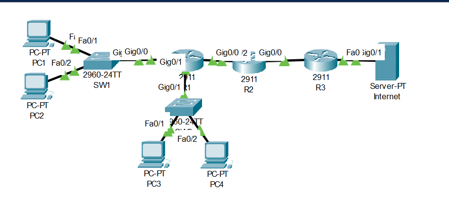
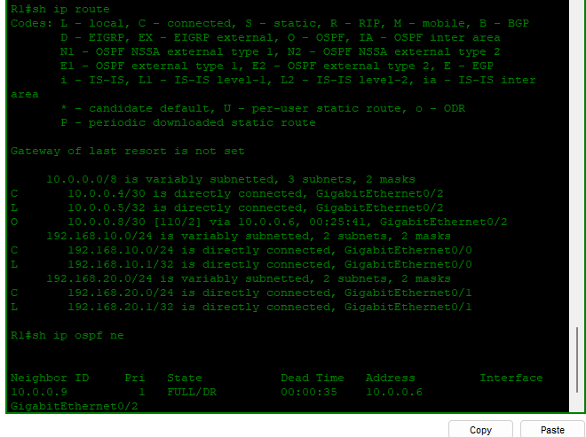
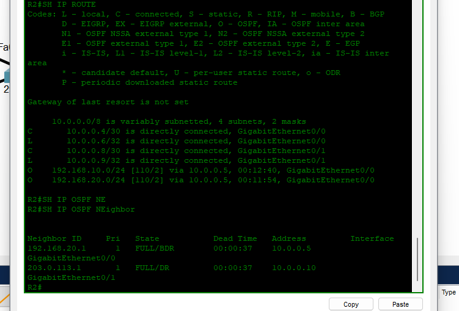
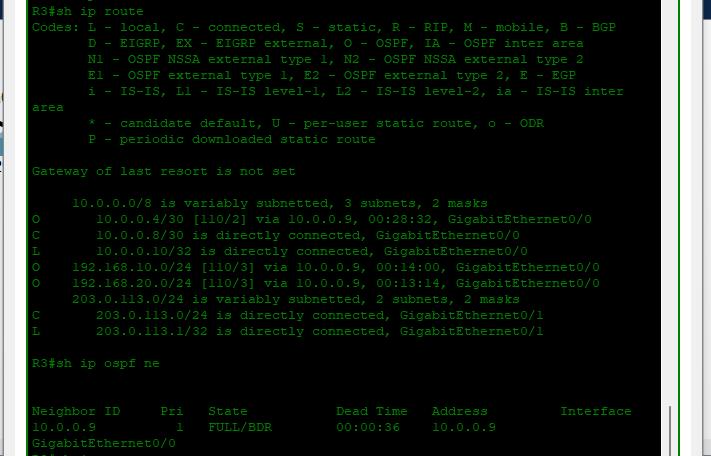
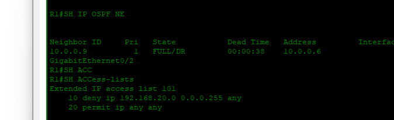

# FINAL LAB: Enterprise Network Troubleshooting Mega Lab

---

# Lab Summary

This final lab demonstrates my ability to **design, diagnose, and repair a complex enterprise network outage** using a systematic troubleshooting methodology.

The network was first configured and verified in a fully operational state.  
A duplicate environment was then intentionally broken with **nine configuration failures** to simulate a real-world outage scenario.

Using structured troubleshooting techniques, I identified the root cause of each issue, corrected the configuration, and restored full connectivity across the network.

---

# Skills Demonstrated

| Domain | Skills |
|------|------|
| Switching | VLAN configuration, trunking, port assignment |
| Routing | Inter-VLAN routing, OSPF dynamic routing |
| Network Services | DHCP configuration, NAT configuration |
| Security | ACL filtering, port security |
| Troubleshooting | CLI diagnostics, root cause analysis |
| Documentation | Structured troubleshooting reporting |

---

# Network Topology

```
                INTERNET
                    |
                    |
                   R3
                    |
               10.0.0.8/30
                    |
                   R2
                    |
               10.0.0.4/30
                    |
                   R1
                 /    \
              SW1      SW2
             /  \      /  \
           PC1  PC2  PC3  PC4
```

---

# Device Inventory

| Device | Model | Role |
|------|------|------|
| R1 | Cisco 2911 | Distribution router / DHCP server / Inter-VLAN routing |
| R2 | Cisco 2911 | Core router |
| R3 | Cisco 2911 | Edge router / NAT gateway |
| SW1 | Cisco 2960 | Access switch (VLAN 10) |
| SW2 | Cisco 2960 | Access switch (VLAN 20) |
| PC1, PC2 | Generic PC | VLAN 10 hosts |
| PC3, PC4 | Generic PC | VLAN 20 hosts |

---

# IP Addressing Plan

| Device | Interface | Address | Subnet |
|------|------|------|------|
| R1 | G0/0.10 | 192.168.10.1 | /24 |
| R1 | G0/0.20 | 192.168.20.1 | /24 |
| R1 | G0/2 | 10.0.0.5 | /30 |
| R2 | G0/0 | 10.0.0.6 | /30 |
| R2 | G0/1 | 10.0.0.9 | /30 |
| R3 | G0/0 | 10.0.0.10 | /30 |
| R3 | G0/1 | 203.0.113.1 | /24 |
| PCs | NIC | DHCP | /24 |

---

# VLAN Design

| VLAN | ID | Switch | Ports | Hosts |
|------|------|------|------|------|
| Users | 10 | SW1 | F0/1, F0/2 | PC1, PC2 |
| Servers | 20 | SW2 | F0/1, F0/2 | PC3, PC4 |

---

# Phase 1 — Working Network

The network was first built and verified to ensure all services and routing were functioning correctly.

### Verification Commands

```
show ip route
show ip ospf neighbor
show ip interface brief
```

### Example Routing Table (R1)

```
C 10.0.0.4/30 via GigabitEthernet0/2
O 10.0.0.8/30 via 10.0.0.6
C 192.168.10.0/24 via GigabitEthernet0/0
C 192.168.20.0/24 via GigabitEthernet0/1
```

### Example OSPF Neighbor

```
Neighbor 10.0.0.9 FULL/DR
```

### Verification Screenshots

  
  


---

# Phase 2 — Broken Network Scenario

After verifying the working environment, a duplicate Packet Tracer file was created and **nine intentional configuration failures were introduced**.

These failures simulated common enterprise network problems.

---

# Introduced Failures

| # | Error | Device | Impact |
|---|---|---|---|
| 1 | Incorrect DHCP gateway | R1 | Clients receive wrong gateway |
| 2 | ACL blocking VLAN20 traffic | R1 | VLAN20 hosts cannot communicate |
| 3 | Incorrect VLAN assignment | SW1 | Hosts placed in wrong broadcast domain |
| 4 | Trunk port misconfigured as access | SW1 | VLAN traffic not forwarded |
| 5 | Port security enabled on trunk | SW1 | Trunk link fails |
| 6 | Missing OSPF network advertisement | R2 | R3 cannot learn routes |
| 7 | OSPF area mismatch | R3 | OSPF adjacency fails |
| 8 | Missing NAT inside configuration | R3 | Internal hosts cannot reach internet |
| 9 | Router interface shutdown | R2 | Link failure between routers |

---

# Broken Network Evidence

### CLI Output

```
show ip interface brief

GigabitEthernet0/1 administratively down
```

```
show access-lists

access-list 101 deny ip 192.168.20.0 0.0.0.255 any
access-list 101 permit ip any any
```

### Screenshots

  


---

# Troubleshooting Methodology

A structured troubleshooting approach was used to isolate each problem.

| Step | Check | Command |
|------|------|------|
| 1 | Interface status | show ip interface brief |
| 2 | VLAN configuration | show vlan brief |
| 3 | Trunk links | show interfaces trunk |
| 4 | IP addressing | show ip interface brief |
| 5 | Routing table | show ip route |
| 6 | OSPF adjacency | show ip ospf neighbor |
| 7 | DHCP configuration | show ip dhcp binding |
| 8 | NAT operation | show ip nat translations |
| 9 | ACL filtering | show access-lists |
| 10 | Port security | show port-security |

---

# Example Troubleshooting Case

### OSPF Neighbor Failure

| Field | Details |
|------|------|
| Symptom | No OSPF neighbor between R2 and R3 |
| Investigation | `show ip ospf neighbor` |
| Root Cause | OSPF area mismatch |
| Fix | Correct network statement to Area 0 |
| Verification | Neighbor state becomes FULL |

---

# Phase 3 — Network Restoration

After correcting all configuration errors:

- OSPF neighbors were re-established
- DHCP services were functioning correctly
- VLAN segmentation was restored
- NAT translations were successful
- Full network connectivity was recovered

---

# Final Connectivity Tests

| Source | Destination | Result |
|------|------|------|
| PC1 | PC4 | Success |
| PC2 | PC3 | Success |
| PC1 | Internet | Success |
| PC4 | Internet | Success |

---

# OSPF Verification

| Router | Neighbor | Status |
|------|------|------|
| R1 | R2 | FULL |
| R2 | R1, R3 | FULL |
| R3 | R2 | FULL |

---

# NAT Verification

```
show ip nat translations
show ip nat statistics
```

Dynamic entries appear when hosts access external networks.


---

# What This Lab Demonstrates

| Skill | Evidence |
|------|------|
| Network Design | Multi-device enterprise topology |
| VLAN Configuration | VLAN segmentation and trunking |
| Routing | OSPF across multiple routers |
| Network Services | DHCP and NAT integration |
| Security | ACL and port security configuration |
| Troubleshooting | 9 configuration failures diagnosed and resolved |
| Documentation | Professional troubleshooting report |


---


*Documented by - Salim Aden*  
